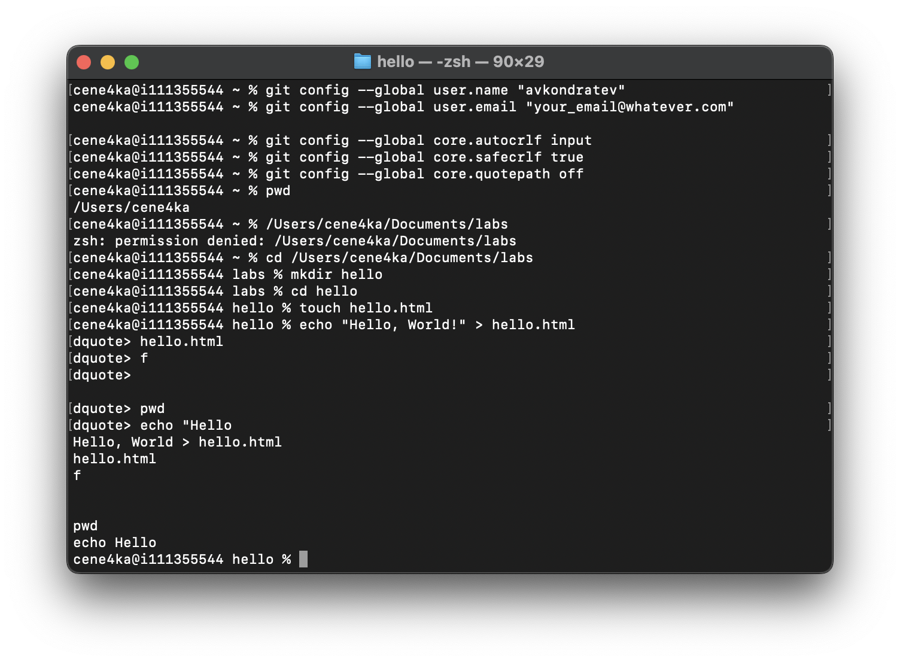
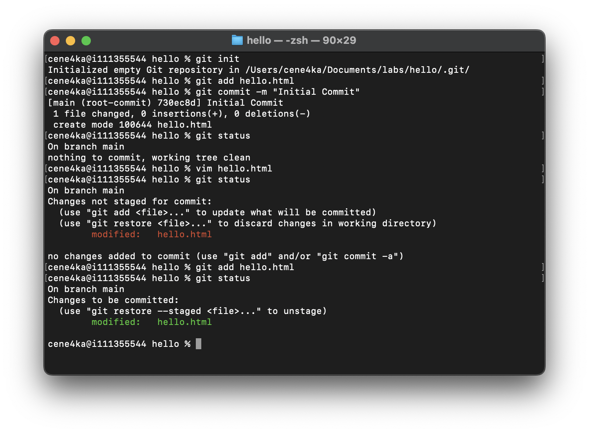
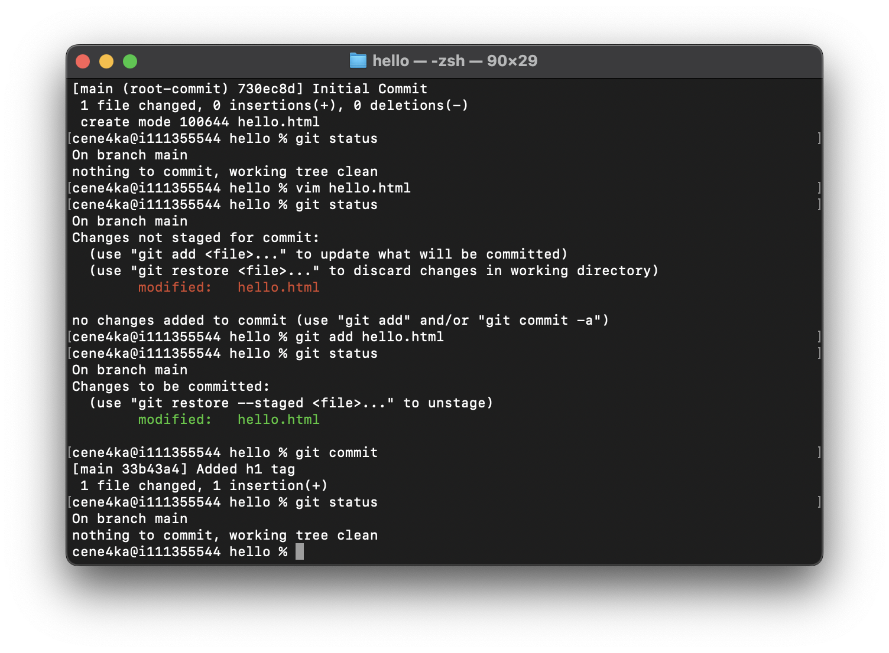
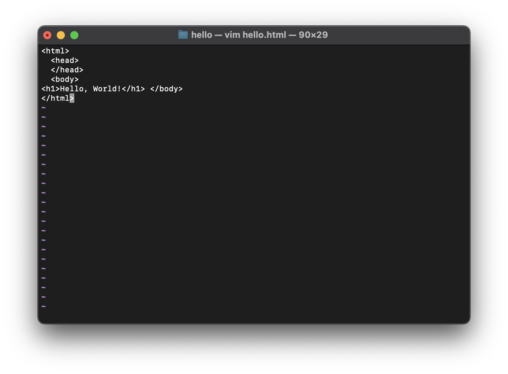
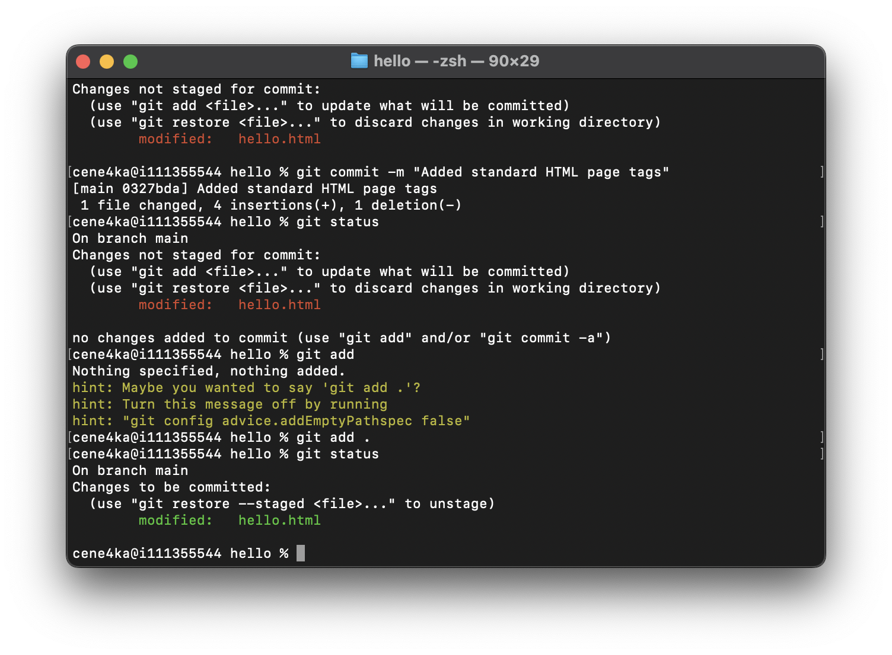

# Цель работы

Настройка рабочего окружения для выполнения последующих лабораторных работ.

# Выполнение лабораторной работы

##

##

##

##

## Выводы

Используя подготовленное окружение, можно выполнять дальнейшие лабораторные работы.
