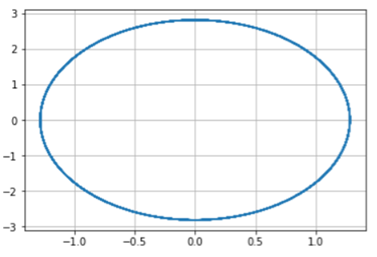
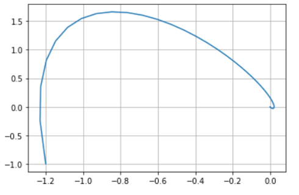
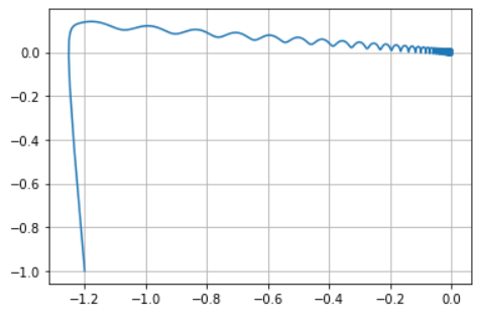

---
## Front matter
title: "Шаблон отчёта по лабораторной работе"
subtitle: "Простейший вариант"
author: "Дмитрий Сергеевич Кулябов"

## Generic otions
lang: ru-RU
toc-title: "Содержание"

## Bibliography
bibliography: bib/cite.bib
csl: pandoc/csl/gost-r-7-0-5-2008-numeric.csl

## Pdf output format
toc: true # Table of contents
toc-depth: 2
lof: true # List of figures
lot: true # List of tables
fontsize: 12pt
linestretch: 1.5
papersize: a4
documentclass: scrreprt
## I18n polyglossia
polyglossia-lang:
  name: russian
  options:
	- spelling=modern
	- babelshorthands=true
polyglossia-otherlangs:
  name: english
## I18n babel
babel-lang: russian
babel-otherlangs: english
## Fonts
mainfont: PT Serif
romanfont: PT Serif
sansfont: PT Sans
monofont: PT Mono
mainfontoptions: Ligatures=TeX
romanfontoptions: Ligatures=TeX
sansfontoptions: Ligatures=TeX,Scale=MatchLowercase
monofontoptions: Scale=MatchLowercase,Scale=0.9
## Biblatex
biblatex: true
biblio-style: "gost-numeric"
biblatexoptions:
  - parentracker=true
  - backend=biber
  - hyperref=auto
  - language=auto
  - autolang=other*
  - citestyle=gost-numeric
## Pandoc-crossref LaTeX customization
figureTitle: "Рис."
tableTitle: "Таблица"
listingTitle: "Листинг"
lofTitle: "Список иллюстраций"
lotTitle: "Список таблиц"
lolTitle: "Листинги"
## Misc options
indent: true
header-includes:
  - \usepackage{indentfirst}
  - \usepackage{float} # keep figures where there are in the text
  - \floatplacement{figure}{H} # keep figures where there are in the text
---

# Цель работы

Построить фазовый портрет гармонического осциллятора и решенить уравнения гармонического осциллятора.

# Теоретическое введение

Движение грузика на пружинке, маятника, заряда в электрическом контуре, а также эволюция во времени многих систем в физике, химии, биологии и других науках при определенных предположениях можно описать одним и тем же дифференциальным уравнением, которое в теории колебаний выступает в качестве основной модели

# Выполнение лабораторной работы

Написал программу на python:
import math
import numpy as np
from scipy.integrate import odeint
import matplotlib.pyplot as plt
x0 = np.array([0, -1.4]) #вектор начальных условий

w1 = 7.4 
g1 = 0.0 

w2 = 0.1
g2 = 10.1

w3 = 3.3
g3 = 3

t0 = 0
tmax = 33
dt = 0.05
t = np.arange(t0, tmax, dt)

def Y1(x, t):
    dx1_1 = x[1]
    dx1_2 = - w1*x[0] - g1*x[1] - 0
    return dx1_1, dx1_2

def Y2(x, t):
    dx2_1 = x[1]
    dx2_2 = - w2*x[0] - g2*x[1] - 0
    return dx2_1, dx2_2

def Y3(x, t):
    dx3_1 = x[1]
    dx3_2 = - w3*x[0] - g3*x[1] - 0.2*math.cos(4*t)
    return dx3_1, dx3_2

x1 = odeint(Y1, x0, t)
x2 = odeint(Y2, x0, t)
x3 = odeint(Y3, x0, t)

y1_1 = x1[:, 0]
y1_2 = x1[:, 1]

y2_1 = x2[:, 0]
y2_2 = x2[:, 1]

y3_1 = x3[:, 0]
y3_2 = x3[:, 1]

plt.plot(y1_1, y1_2)
plt.grid(axis = 'both')

plt.plot(y2_1, y2_2)
plt.grid(axis = 'both')

plt.plot(y3_1, y3_2)
plt.grid(axis = 'both')
Получил следующие графики

{#fig:001 width=70%}
{#fig:001 width=70%}
{#fig:001 width=70%}

# Выводы

Построил фазовый портрет гармонического осциллятора и решенил уравнения гармонического осциллятора.

::: {#refs}
:::
